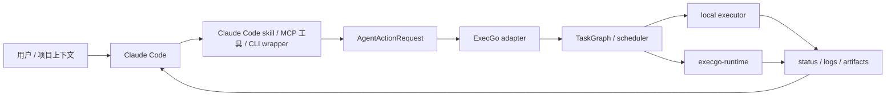

Claude Code 适合承担代码理解、计划拆分、补丁编辑和结果解释。ExecGo 不应该替代 Claude Code 的交互体验，而应该成为它执行真实动作时的可靠执行层：命令、文件、runtime job、外部 API 和多步骤任务图都通过统一契约落地。

<DocsGrid>
  <DocsCard
    href="/docs/execgo/integration/agent-adapter"
    eyebrow="共同契约"
    title="通用 Agent adapter"
    description="先理解 tools manifest、AgentActionRequest、/adapters/actions 与 TaskGraph 翻译边界。"
  />
  <DocsCard
    href="/docs/execgo/integration/mode-a-cli"
    eyebrow="最小接入"
    title="execgocli 模式"
    description="把 Agent 的结构化动作写入 execgocli act，再用 wait 读取终态。"
  />
  <DocsCard
    href="/docs/runtime/api"
    eyebrow="数据面"
    title="execgo-runtime API"
    description="长任务、进程隔离、artifact、取消和事件流应交给 runtime 数据面。"
  />
</DocsGrid>

官方文档中，Claude Code 可以通过 skills 扩展能力，也可以通过 MCP 连接外部工具和数据源；因此 ExecGo 的接入点既可以是一个 Claude Code skill，也可以是一个 MCP server，最小实现则可以是本地 `execgocli` wrapper。参考：[Claude Code skills](https://code.claude.com/docs/en/skills) 与 [Claude Code MCP](https://code.claude.com/docs/en/mcp)。


## 总体定位

Claude Code 的接入目标不是把 ExecGo 变成另一个聊天机器人，也不是让 ExecGo 接管 Claude Code 的推理过程。更稳妥的边界是：Claude Code 继续负责理解用户意图、管理上下文、拆解计划、选择工具和解释结果；ExecGo 负责把已经明确的动作变成可追踪任务；execgo-runtime 负责把需要进程隔离、资源限制、artifact 留存或长期审计的任务落到数据面。这个边界看似简单，但在真实团队里非常关键。许多 Agent demo 的失败并不是模型不会规划，而是执行动作无法被复盘：命令是否真的运行过、参数是谁生成的、运行在哪个目录、环境变量来自哪里、日志有没有保留、失败后是自动重试还是等待人工确认、取消请求有没有传到真正的子进程。ExecGo 应该补齐的正是这些工程语义。

接入 Claude Code 时，建议把 ExecGo 暴露成一个“动作落地层”，而不是暴露成大量零散的 shell、HTTP、文件和 runtime 端点。Agent 看到的工具越多，选择成本和误选风险越高；Agent 看到的是一个结构化入口时，团队就可以把权限、审计、幂等、资源限制、重试策略和状态回传集中放在 adapter 里。最小入口通常是 `execgocli act` 或 `POST /adapters/actions`，更完整的入口可以是一个 MCP server、一个 Agent skill、一个本地工具插件，或者一个组织内部的 tool gateway。无论表层入口是什么，最终都应该收敛到同一份 `AgentActionRequest`，这样不同 Agent 的接入方式可以复用同一套日志、监控和排障方法。

这个章节把 Claude Code 放在 代码仓库、命令行开发、测试修复、重构迁移和自动化排障 的场景里讨论。它假设团队已经有可运行的 ExecGo 控制面，必要时也有 execgo-runtime 数据面；也假设 Claude Code 已经能够发起结构化工具调用、运行本地命令、调用 HTTP 服务，或者通过某种扩展机制调用外部工具。如果某个部署形态暂时没有这些能力，也不应该绕过 ExecGo 去拼接临时 shell；更好的做法是先用最薄的 wrapper 把 action 写入标准输入，再由 `execgocli` 完成提交和等待。这样做的好处是迁移成本低：一开始只需要一个命令行工具，后续可以平滑升级为 MCP、插件、后台服务或多租户网关。

## 推荐架构

推荐架构可以分成四层。第一层是 Claude Code 自己的交互层，包含用户对话、项目上下文、记忆、计划、工具选择和结果解释。第二层是 ExecGo adapter 层，它把 Agent 生成的动作规范化为 `os.shell`、`os.file`、`os.http`、`runtime.command`、`runtime.script`、`mcp.call`、`cli.run` 或 `task_graph.submit` 等 action kind。第三层是 ExecGo 控制面，它做 schema 校验、任务图生成、依赖调度、状态持久化、取消、重试、超时和 executor 路由。第四层是执行层，可能是本机 executor，也可能是 execgo-runtime 负责的进程执行、artifact 持久化和资源控制。四层之间不共享隐式状态，所有跨层数据都通过 JSON 契约传递。

在实际实现中，Claude Code 不应该直接感知 ExecGo 的所有内部字段。Agent 只需要知道几个稳定概念：`adapter` 表示接入来源，建议使用 `claudecode`；`agent_id` 表示具体 Agent 或团队身份；`session_id` 连接一次用户会话或一次长期任务；`action_id` 保证同一个动作可以幂等追踪；`action.kind` 描述动作类型；`action.input` 描述执行参数；`timeout`、`retry`、`metadata` 和 `control_context` 描述执行边界。ExecGo adapter 可以在后端补齐默认值，例如工作目录、tenant、owner、资源策略、artifact 策略、日志级别和安全 profile。

一个健康的接入拓扑通常不是“Agent 直接执行命令”，而是“Agent 提议动作，ExecGo 接收动作，执行层真实执行，结果再回到 Agent”。这给团队留下了两个重要控制点。第一个控制点在提交之前：可以做静态校验、命令分类、路径约束、敏感参数扫描、风险确认和 dry-run 翻译。第二个控制点在执行之后：可以把 stdout、stderr、exit_code、artifact、事件流、耗时、资源使用和取消原因统一回传。Claude Code 只需要解释这些结构化结果，而不需要把所有日志塞回上下文窗口。



## 接入入口选择

Claude Code 的入口优先级建议是：先用 skill 描述 ExecGo 的使用规则和 JSON 契约，再用 MCP 或 CLI wrapper 提供真正的动作提交能力。Skill 适合放置“什么时候使用 ExecGo”“如何选择 action kind”“高风险动作如何确认”“如何解释返回值”等流程性说明；MCP 或 CLI 适合承载真实执行。若团队已经有 Claude Code 项目级说明，可以在说明中要求所有超过简单读取的外部动作都走 ExecGo，而不是让 Claude Code 直接运行长命令。

无论选择哪种入口，都建议从 tools manifest 开始。`GET /adapters/tools` 或 `execgocli tools` 返回的是给 Agent 暴露能力的清单，里面应该包含每个工具的用途、输入 schema、风险说明和返回结构。Claude Code 不应该靠自然语言猜测 ExecGo 能做什么，而应该从 manifest 中读取可用能力。团队也可以把 manifest 缓存到 Agent 的 skill、项目说明或工具注册表里，但缓存必须有版本字段和刷新策略，否则 adapter 升级后 Agent 可能继续提交旧字段。

入口命名也很重要。不要给 Agent 暴露很多过细的工具名，例如 `run_shell`、`write_file`、`curl_http`、`submit_runtime`、`cancel_pid`。更推荐暴露一到两个稳定入口：`execgo_action` 用来提交结构化 action，`execgo_wait` 用来等待任务终态或读取事件。这样 Agent 在规划时不会被工具数量干扰，权限系统也更容易配置。若团队希望把高风险动作拆开，可以在 adapter 里按 `action.kind` 做权限分层，而不是在 Agent 的工具面板里堆满命令。

## Action 映射策略

映射策略的核心是“保留 Agent 意图，减少执行歧义”。Claude Code 生成的动作通常来自自然语言计划，例如“运行测试”“更新依赖”“读取配置”“调用部署 API”“启动一个长任务”。Adapter 不应该把这些意图直接拼接成一串 shell；它应该先把动作归类，再生成确定性 JSON。常见规则如下：短命令和本地诊断归入 `os.shell`；文件读写归入 `os.file`；HTTP 请求归入 `os.http`；需要独立 runtime、资源限制或 artifact 留存的进程归入 `runtime.command`；需要脚本内容、临时文件和长 stdout 的任务归入 `runtime.script`；需要调用外部工具服务器的任务归入 `mcp.call`；需要复用已有 CLI 的任务归入 `cli.run`；多步骤依赖图归入 `task_graph.submit`。

同一个动作在不同上下文中可能选择不同 kind。例如“运行测试”在个人本地仓库里可以是 `os.shell`，在 CI 预检、团队共享环境或需要保存完整 artifact 的场景里应该是 `runtime.command`。Adapter 可以根据 `metadata.risk_level`、工作目录、文件影响范围、预计耗时和用户授权状态做路由。Claude Code 不必知道所有路由细节，但它需要给 adapter 足够的信息：为什么要执行、期望产物是什么、失败时是否允许重试、是否会修改文件、是否需要用户确认。

```json
{
  "adapter": "claudecode",
  "agent_id": "claude-code",
  "session_id": "session-2026-07-10-001",
  "action_id": "claudecode-build-test-001",
  "metadata": {
    "source_agent": "Claude Code",
    "intent": "验证当前代码改动",
    "risk_level": "medium"
  },
  "action": {
    "kind": "runtime.command",
    "input": {
      "program": "npm.cmd",
      "args": ["run", "build"],
      "cwd": "C:/workspace/project",
      "limits": {
        "wall_time_ms": 600000,
        "memory_bytes": 1073741824,
        "pids_max": 128
      },
      "sandbox": {
        "profile": "process"
      },
      "control_context": {
        "tenant": "docs",
        "owner": "claude-code",
        "requires_resource_reservation": true
      }
    },
    "timeout": 600000,
    "retry": 0
  }
}
```

## 上下文、身份与幂等

Agent 接入最容易被忽略的是身份建模。`agent_id` 不应该随便填一个固定字符串，因为它会出现在审计、配额、告警和 artifact 路径里。推荐把身份分成三层：产品来源、组织主体和会话主体。产品来源可以是 `claudecode`；组织主体可以是团队、项目、租户或服务账号；会话主体可以是一次聊天、一次任务、一条工单或一个自动化运行。组合后可以得到类似 `claude-code:team-a:issue-123` 的 owner。这样同一个 Agent 在不同团队中执行任务时不会互相污染。

`action_id` 则负责幂等。Agent 经常会因为网络抖动、上下文重试或工具超时重复提交同一个动作。若没有稳定 `action_id`，ExecGo 会把重复请求当成新任务执行，可能导致重复部署、重复写文件或重复触发外部 API。建议由 Agent 或 wrapper 在动作生成时创建 `action_id`，格式包含会话、步骤和语义，例如 `session-001.step-04.run-build`。ExecGo 收到相同 `action_id` 时应能返回已有任务，或者至少在 adapter 层做重复检测。对于不可幂等动作，例如发送邮件、合并 PR、删除资源，必须把确认记录和外部资源 ID 放入 metadata。

上下文传递也要克制。不要把 Claude Code 的完整对话、系统提示、隐藏推理或用户敏感信息全部塞进 `metadata`。ExecGo 需要的是执行上下文，而不是思考上下文。推荐传递最小可审计字段：用户可见意图、相关工单或文件路径、执行原因、授权来源、风险级别、预期 artifact、回调地址或追踪 ID。这样既能复盘，又不会把 Agent 的高敏上下文扩散到执行层日志中。

## 权限与安全边界

Claude Code 经常运行在开发者本机或代码仓库上下文中，风险集中在文件修改、测试命令、依赖安装、网络访问和 Git 操作。接入 ExecGo 后，应把“Claude Code 可以提出动作”和“动作真的能执行”分离。Claude Code 可以根据计划生成 `runtime.command`，但 adapter 必须校验工作目录、命令、参数和修改范围；涉及提交、推送、发布、删除、数据库迁移的动作应进入更高风险级别，并需要显式确认或组织策略授权。

安全策略应分成提交权限、执行权限和结果权限。提交权限决定 Claude Code 是否可以创建某类 action；执行权限决定 action 在什么 executor 或 runtime profile 下运行；结果权限决定哪些日志和 artifact 可以回传给 Agent。很多团队只做提交权限，结果导致 Agent 只要能调用工具，就可以间接读取敏感文件或把日志带回上下文。ExecGo 的价值在于把三类权限拆开，例如允许 Agent 提交 `runtime.command`，但只允许在受限目录运行；允许查看 exit_code 和摘要，但敏感 artifact 需要人工授权；允许重试构建，但不允许自动重试生产部署。

对 shell 类 action，adapter 应该做至少四项校验：命令是否在允许列表中，工作目录是否在项目根内，参数是否包含秘密或危险路径，输出是否可能泄露凭据。对文件类 action，必须区分读取、写入、追加、删除和重命名。对 HTTP 类 action，必须限制域名、方法、请求体大小和重定向。对 runtime 类 action，必须设置 `wall_time_ms`、内存、进程数、网络策略和 artifact 保留期限。对 `mcp.call` 和 `cli.run`，要记录被调用工具的版本和输入摘要，因为真实风险往往隐藏在下游工具里。

## 状态回传和 Agent 体验

Agent 需要的不是一大段原始日志，而是可解释的执行状态。ExecGo 返回给 Claude Code 的信息建议分层：第一层是立即响应，说明 action 是否被接受、生成了哪些 task id、是否经过翻译、有没有静态告警；第二层是轮询或事件流，说明任务处于 pending、running、succeeded、failed、cancelled 还是 timeout；第三层是结果摘要，包含 exit_code、关键 stdout/stderr 摘要、artifact 列表和下一步建议；第四层是深度排障链接，指向完整日志、request.json、result.json、trace 或 runtime artifact。

这样设计可以让 Claude Code 保持良好的用户体验。它可以先告诉用户“任务已提交并开始运行”，而不是阻塞等待长命令；中途可以用状态事件更新进度；失败时可以根据结构化错误判断是参数错误、环境错误、权限错误、超时、取消还是下游工具失败。更重要的是，Agent 可以把失败变成新的计划，而不是只把日志贴给用户。例如 build 失败时，Agent 可以读取 artifact 中的错误摘要，再决定是否需要查看完整日志、修复代码或要求用户确认。

## runtime 与 artifact 设计

只要动作可能超过几十秒、产生大量输出、需要隔离环境、需要并发控制、需要资源限制或需要留存证据，就应该优先交给 execgo-runtime。Claude Code 不应该把这类任务留在自己的工具进程里执行，因为 Agent 进程通常不是为长生命周期任务设计的。runtime 可以把任务从聊天会话中解耦出来，保留输入、输出、事件、文件和结果，即使 Agent 会话断开，任务也可以继续执行或被运维系统接管。

Artifact 的设计要服务于复盘。建议为每个 runtime 任务保存 `request.json`、`result.json`、`stdout.log`、`stderr.log`、必要的产物目录和一个机器可读的 `summary.json`。`summary.json` 可以由 executor 或后处理器生成，包含错误分类、关键指标、产物路径和推荐下一步。Claude Code 回看任务时优先读取 summary，而不是把完整日志塞进上下文。对于大文件、二进制产物和敏感数据，只返回 artifact handle，不直接返回内容。

## 错误处理、取消和重试

Agent 工具调用常见的失败分三类：提交失败、执行失败和回传失败。提交失败通常是 JSON schema 不合法、字段缺失、权限不足或 adapter 不支持某个 kind；这类错误应立即返回给 Claude Code，并带上可修复的字段路径。执行失败发生在任务已经创建之后，例如命令退出码非零、runtime 不可用、资源超限、网络失败或超时；这类错误应该进入任务状态机，并允许 Agent 查询详细结果。回传失败则是 Agent 会话断开或工具调用超时，但任务仍在后台运行；这时必须能通过 `session_id` 或 `action_id` 重新发现任务。

取消语义需要从一开始就设计。用户在 Claude Code 中点击停止或发出取消指令时，wrapper 应该调用 ExecGo 的取消端点，而不是只停止本地等待进程。停止等待不等于取消任务，尤其是 runtime 任务可能还在执行。取消请求要向下传到 executor 或 runtime，并在状态里记录取消发起方、时间和是否成功。如果任务不可取消，也要明确返回原因。重试同样要谨慎：只允许对幂等动作自动重试，非幂等动作必须由 Agent 解释风险并等待确认。

## 团队落地步骤

第一步是定义最小 action 集。不要一开始就暴露所有 executor 能力，而是先选择三到五类高价值动作，例如运行测试、生成构建、读取诊断文件、调用内部只读 API、提交 runtime job。第二步是为 Claude Code 做薄 wrapper：读取 tools manifest，接收结构化 JSON，调用 `execgocli act`，必要时调用 `execgocli wait`。第三步是接入审计：每个 action 都必须有 `agent_id`、`session_id`、`action_id`、用户可见意图和风险级别。第四步是加权限策略：按 kind、目录、命令、域名、runtime profile 和 tenant 做允许列表。第五步才是优化体验，例如事件流、artifact 摘要、自动诊断和 UI 链接。

落地过程中要把 Claude Code 的提示词和 ExecGo 的 adapter 策略分开管理。提示词告诉 Agent 什么时候应该提交动作、如何解释结果、什么时候需要确认；adapter 策略决定动作是否允许执行、如何翻译、运行在哪里、失败如何归类。二者不能混在一起，否则提示词改动会影响执行安全，或者安全策略变成只能靠模型遵守的软约束。团队应该把硬规则放在代码、配置和 schema 里，把软引导放在 Agent 的 skill 或项目说明里。

## Claude Code 专属建议

Claude Code 页面要特别强调三点。第一，skill 里不要复制一大段 ExecGo API 细节，而要写清楚决策规则：短命令何时用 `os.shell`，长任务何时用 `runtime.command`，多步骤何时用 `task_graph.submit`。第二，MCP server 若作为入口，应只暴露少量工具，例如 `execgo_tools`、`execgo_action`、`execgo_wait`、`execgo_cancel`；不要把每个 executor 都变成一个 MCP tool。第三，Claude Code 的补丁编辑能力很强，但真实验证命令应该交给 ExecGo，这样用户能从任务 ID 看到验证是否真的运行、运行多久、失败原因是什么、artifact 在哪里。

团队可以把 Claude Code 的使用流程写成：先阅读仓库说明，形成计划；需要执行时生成 `AgentActionRequest`；调用 ExecGo；等待结果；根据结构化结果决定修复、重试或询问用户。对于代码修改后的验证，推荐把 lint、test、build、integration test 都变成可配置 action，而不是让 Claude Code 在不同项目里临时猜命令。这样做可以把“会不会运行验证”变成硬流程，而不是靠每次提示词提醒。

## 示例：Claude Code wrapper 提交流程

下面的示例故意保持在通用 JSON 层，而不是绑定某个版本的私有插件协议。实际落地时，可以把这段 JSON 放进 Claude Code skill / MCP 工具 / CLI wrapper 的工具输入，或者由 wrapper 根据用户意图生成。

```bash
export EXECGO_URL=http://127.0.0.1:8080
execgocli act <<'EOF'
{
  "adapter": "claudecode",
  "agent_id": "claude-code",
  "session_id": "agent-session-001",
  "action_id": "claudecode-runtime-smoke-001",
  "metadata": {
    "source": "Claude Code",
    "intent": "运行一次受控 smoke test",
    "risk_level": "low",
    "user_visible_reason": "确认 ExecGo 与 runtime 通路可用"
  },
  "action": {
    "kind": "runtime.command",
    "input": {
      "program": "node",
      "args": ["--version"],
      "cwd": ".",
      "limits": {
        "wall_time_ms": 30000,
        "memory_bytes": 268435456,
        "pids_max": 16
      },
      "sandbox": {
        "profile": "process"
      },
      "control_context": {
        "tenant": "default",
        "owner": "claude-code",
        "requires_resource_reservation": false
      }
    },
    "timeout": 30000,
    "retry": 0
  }
}
EOF
```

如果返回 `ok: true`，Claude Code 应读取 `data.task_ids` 并继续调用 `execgocli wait` 或任务查询端点。如果返回 `ok: false`，不要让 Agent 猜测失败原因，应把 `error.message`、字段路径、HTTP 状态和 `error.body` 摘要回传给用户或进入自动修复流程。

## 验收清单

- Claude Code 能通过一个稳定入口提交 `AgentActionRequest`，而不是直接拼接临时 shell。
- `adapter`、`agent_id`、`session_id`、`action_id`、`metadata.intent` 和 `metadata.risk_level` 都能在 ExecGo 日志中看到。
- `GET /adapters/tools` 或 `execgocli tools` 能描述 Claude Code 可用的动作范围和输入 schema。
- 对同一个 `action_id` 重复提交不会造成重复执行，或至少会被 adapter 明确拒绝。
- 高风险动作有确认路径，确认记录能进入 metadata 或审计日志。
- runtime 任务有资源限制、超时、取消、stdout/stderr、request/result 和 artifact。
- Agent 会话断开后，可以用 `session_id` 或 `action_id` 找回任务状态。
- 失败结果能被 Claude Code 解释成下一步，而不是只返回原始日志。
- 权限策略不依赖模型自觉遵守，关键限制在 adapter、executor 或 runtime 中强制执行。
- 团队能从一次任务 ID 追踪到提交者、输入、翻译后的 TaskGraph、执行节点、输出和最终状态。

## 常见反模式

第一个反模式是把 ExecGo 当成“更强的 shell”。如果 Claude Code 只是把所有用户请求都转成 `bash -lc`，那么 ExecGo 只能记录一段字符串，无法理解风险、资源、artifact 和幂等。第二个反模式是把所有工具都直接暴露给 Agent，让模型在几十个工具之间选择。工具越多，选择越不稳定，也越难做权限审计。第三个反模式是把 Agent 的完整上下文写入执行日志。这样虽然方便调试，但会扩大敏感信息暴露范围。第四个反模式是只关注成功路径，不设计取消、超时、重复提交和回传失败。真实生产环境里，长任务失败和用户中途取消比 demo 更常见。

第五个反模式是让 Claude Code 自己解释底层执行策略。例如提示词里写“不要删除重要文件”并不等于安全策略；真正的限制应该落在目录白名单、文件操作 kind、审批和沙箱上。第六个反模式是用不同 Agent 写不同协议。Claude Code、Codex、Hermes Agent、OpenClaw 和自研 Agent 的扩展机制不同，但到 ExecGo 的边界应该一致。如果每个 Agent 都有一套独立 HTTP、字段名和错误格式，后续监控、审计和运维会变得不可控。

