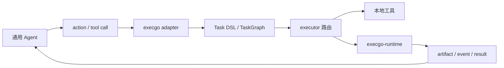

Claude Code、Codex、Hermes Agent、OpenClaw 以及自研 Agent 通常已经负责推理、上下文、规划、工具选择和用户交互。execgo 不需要再做一套 Agent 框架；它应该站在这些通用 Agent 后面，把 Agent 选定的 action 变成可靠任务。

这个板块关注的是接入方式，而不是替换 Agent：Agent 负责决定要做什么，execgo 控制面负责把动作变成任务和状态机，execgo-runtime 数据面负责真实执行、留存 artifact，并提供可审计的运行边界。

<DocsGrid>
  <DocsCard
    href="/docs/execgo/integration/agent-adapter"
    eyebrow="适配器"
    title="Agent adapter"
    description="理解 action 翻译、工具发现、适配器端点和通用 Agent 接入 execgo 的基本契约。"
  />
  <DocsCard
    href="/docs/execgo/examples/execgocli-agent-wrappers"
    eyebrow="封装"
    title="execgocli wrappers"
    description="查看如何用 CLI wrapper 把现有 Agent 的工具调用转交给 execgo。"
  />
  <DocsCard
    href="/docs/runtime/api"
    eyebrow="执行"
    title="runtime API"
    description="当动作需要独立数据面时，了解 execgo-runtime 的提交、状态、事件与取消接口。"
  />
  <DocsCard
    href="/docs/ecosystem/execgo-and-runtime"
    eyebrow="边界"
    title="控制面与数据面"
    description="理解 Agent、execgo 和 execgo-runtime 之间的职责拆分与调用路径。"
  />
</DocsGrid>

## 推荐接入模式

**工具封装模式** 适合已经有 CLI 或本地工具的 Agent。你可以把 Agent 的工具调用包装成 `execgocli` 或 adapter 端点，让 execgo 统一记录任务、状态和失败语义。

**控制面代理模式** 适合需要统一调度的团队。Agent 只提交结构化 action，execgo 负责任务图、依赖、取消、重试、超时和 executor 选择。

**runtime 执行模式** 适合需要更强运行边界的任务。execgo 把进程密集型动作交给 execgo-runtime，由 runtime 负责 shim、日志、artifact、健康检查和资源策略。

**审计回传模式** 适合需要复盘的 Agent 工作流。Agent 不只拿到文本结果，还能拿到任务 ID、事件、stdout/stderr、`request.json`、`result.json` 和 artifact 路径。

接入时最重要的原则是保持边界清楚：通用 Agent 保留自己的思考与上下文系统，execgo 提供可靠控制面，execgo-runtime 提供可运维数据面。
