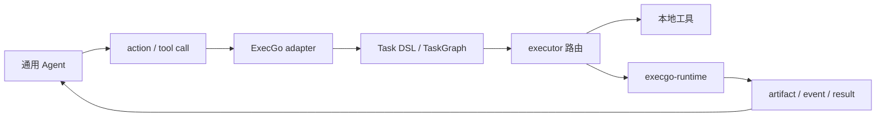

Claude Code、Codex、Hermes Agent、OpenClaw 以及自研 Agent 通常已经负责推理、上下文、规划、工具选择和用户交互。ExecGo 不需要再做一套 Agent 框架；它应该站在这些通用 Agent 后面，把 Agent 选定的 action 变成可靠任务。

这个板块关注的是接入方式，而不是替换 Agent：Agent 负责决定要做什么，ExecGo 控制面负责把动作变成任务和状态机，execgo-runtime 数据面负责真实执行、留存 artifact，并提供可审计的运行边界。

<DocsGrid>
  <DocsCard
    href="/docs/agent/claude-code"
    eyebrow="Claude Code"
    title="Claude Code 接入 ExecGo"
    description="用 skill、MCP 或 CLI wrapper 把 Claude Code 的真实执行动作交给 ExecGo。"
  />
  <DocsCard
    href="/docs/agent/codex"
    eyebrow="Codex"
    title="Codex 接入 ExecGo"
    description="用 AGENTS.md、skill、plugin、MCP 和 execgocli 组织 Codex 的可靠执行流。"
  />
  <DocsCard
    href="/docs/agent/hermes-agent"
    eyebrow="Hermes Agent"
    title="Hermes Agent 接入 ExecGo"
    description="把长期记忆、技能学习和消息入口背后的真实执行纳入任务审计。"
  />
  <DocsCard
    href="/docs/agent/openclaw"
    eyebrow="OpenClaw"
    title="OpenClaw 接入 ExecGo"
    description="把本机个人助手、多聊天入口和 isolated agent workspace 映射到 ExecGo 执行边界。"
  />
  <DocsCard
    href="/docs/agent/custom-agent"
    eyebrow="自研 Agent"
    title="自研 Agent 接入 ExecGo"
    description="为内部 Agent、业务机器人和多租户执行平台设计统一 action 契约。"
  />
  <DocsCard
    href="/docs/execgo/integration/agent-adapter"
    eyebrow="共同底座"
    title="通用 Agent adapter"
    description="理解 action 翻译、工具发现、适配器端点和通用 Agent 接入 ExecGo 的基本契约。"
  />
</DocsGrid>

## 推荐阅读顺序

如果你只想快速接入一个 Agent，先读对应 Agent 的章节，再看 [通用 Agent adapter](/docs/execgo/integration/agent-adapter) 和 [execgocli 模式](/docs/execgo/integration/mode-a-cli)。如果你要做团队级落地，建议按“共同底座 -> 具体 Agent -> runtime 数据面 -> 安全策略”的顺序阅读。不同 Agent 的扩展机制不同，但进入 ExecGo 后应使用同一份 `AgentActionRequest`、同一套状态机和同一套 artifact 约定。

## 推荐接入模式

**工具封装模式** 适合已经有 CLI 或本地工具的 Agent。把 Agent 的工具调用包装成 `execgocli` 或 adapter 端点，让 ExecGo 统一记录任务、状态和失败语义。

**控制面代理模式** 适合需要统一调度的团队。Agent 只提交结构化 action，ExecGo 负责任务图、依赖、取消、重试、超时和 executor 选择。

**runtime 执行模式** 适合需要更强运行边界的任务。ExecGo 把进程密集型动作交给 execgo-runtime，由 runtime 负责 shim、日志、artifact、健康检查和资源策略。

**审计回传模式** 适合需要复盘的 Agent 工作流。Agent 不只拿到文本结果，还能拿到任务 ID、事件、stdout/stderr、request.json、result.json 和 artifact 路径。

接入时最重要的原则是保持边界清楚：通用 Agent 保留自己的思考与上下文系统，ExecGo 提供可靠控制面，execgo-runtime 提供可运维数据面。
