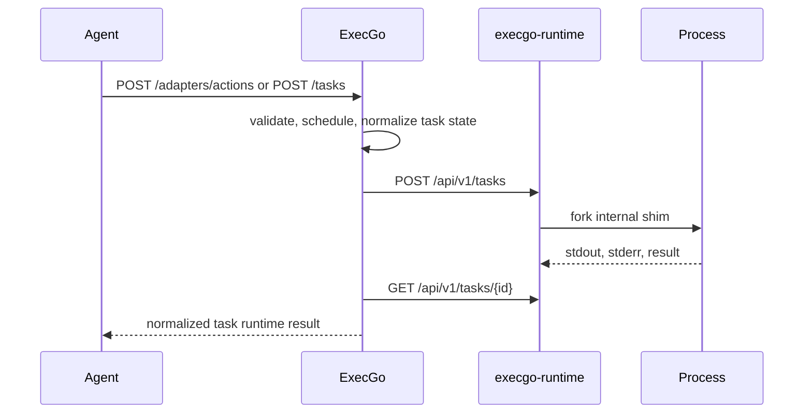

ExecGo and execgo-runtime are related but not the same deployment unit.

ExecGo accepts structured actions or task graphs from an agent. It is responsible for validation, orchestration, retry, timeout, cancellation, state, and observability. It can run local executor categories directly, or forward process-heavy tasks to a runtime executor.

execgo-runtime accepts explicit runtime task requests. It is responsible for child-process execution, stdout and stderr capture, task directories, SQLite metadata, runtime events, readiness, and host capability reporting.

## When ExecGo is enough

Use only ExecGo when tasks are lightweight, the execution host is already trusted, and built-in executor categories are sufficient:

- OS tools for simple shell, file, DNS, TCP, sleep, noop, and HTTP probes.
- MCP or CLI-skills tools that already expose the required execution boundary.
- Agent adapter workflows where the action can complete inside the control-plane process.

## When to add execgo-runtime

Add execgo-runtime when process execution needs a stronger operational boundary:

- Long-running commands or scripts.
- Task artifact directories for replay and audit.
- Runtime-level readiness and capability probing.
- Resource reservation, tenant metadata, owner-gated cancellation, or Linux sandbox/cgroup capabilities.

## Call path

The contract between the two projects is HTTP. That is why both repositories can stay independently versioned while the website documents their supported integration surface together.
