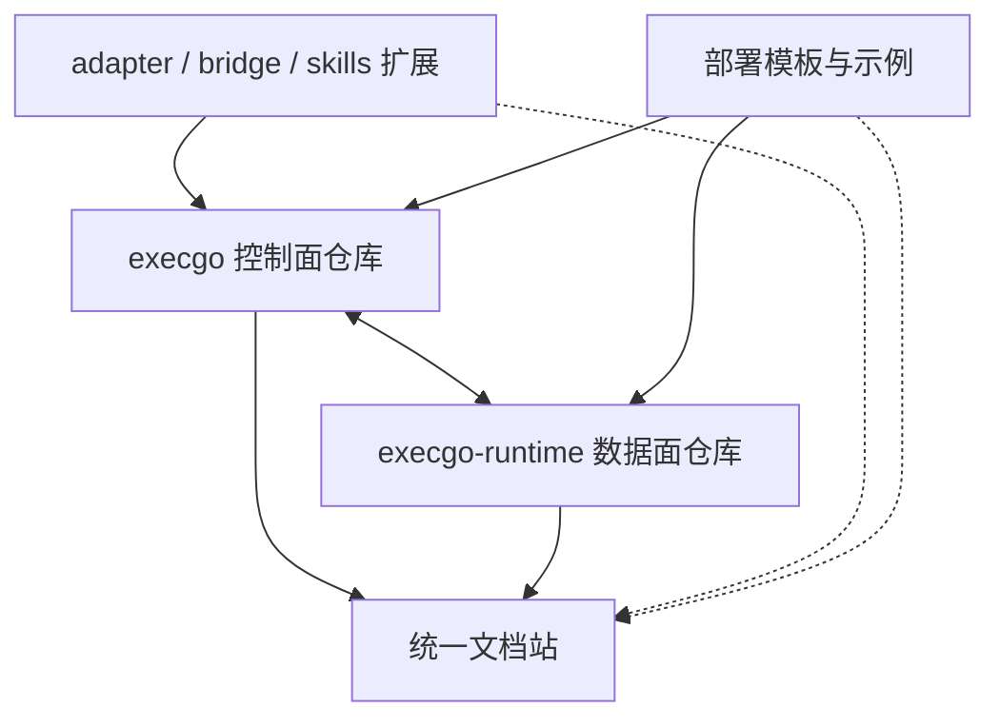

execgo 生态不是一个总仓库，也不应该把所有组件强行合并成同一个发布单元。它由多个独立项目组成，每个项目有自己的版本、发布节奏和工程边界，但通过清晰的 API、任务契约和文档站统一展示。

- **execgo** 是控制面项目，负责任务 DSL、TaskGraph、executor 路由、Agent adapter、状态与调度语义。
- **execgo-runtime** 是数据面项目，负责真实进程执行、artifact、事件、资源账本、capability 和运行时运维。
- **execgo-publish-website** 是文档展示项目，负责把多个独立仓库的内容同步到统一 MDX 文档站。
- **未来扩展组件** 可以围绕 skills、bridge、adapter、runtime executor 或部署模板继续生长，但不应破坏已有边界。

生态层文档关注的是“项目如何组合”，不是替代控制面或数据面的具体 API 文档。

<DocsGrid>
  <DocsCard
    href="/docs/ecosystem/execgo-and-runtime"
    eyebrow="边界"
    title="ExecGo 与 execgo-runtime"
    description="说明控制面/数据面拆分、可选 runtime 依赖、调用路径与职责边界。"
  />
  <DocsCard
    href="/docs/ecosystem/versioning"
    eyebrow="发布"
    title="版本与兼容性"
    description="说明如何保持独立仓库发布，同时文档化受支持的集成面与兼容规则。"
  />
  <DocsCard
    href="/docs/execgo"
    eyebrow="控制面"
    title="控制面 execgo"
    description="进入控制面文档，阅读调度器、适配器、部署、API、Task DSL 与客户端接入。"
  />
  <DocsCard
    href="/docs/runtime"
    eyebrow="数据面"
    title="数据面 execgo-runtime"
    description="进入数据面文档，阅读架构、API、CLI、部署、开发与 runtime 运维。"
  />
  <DocsCard
    href="/docs/agent"
    eyebrow="Agent"
    title="通用 Agent 结合"
    description="了解 Claude Code、Codex、Hermes Agent、OpenClaw 等如何接入可靠执行层。"
  />
</DocsGrid>

生态规划的基本原则是：仓库独立管理，版本独立发布；文档统一展示，契约统一说明；控制面保持轻量，数据面保持可运维；新增组件优先围绕明确的 API 和执行边界扩展。
