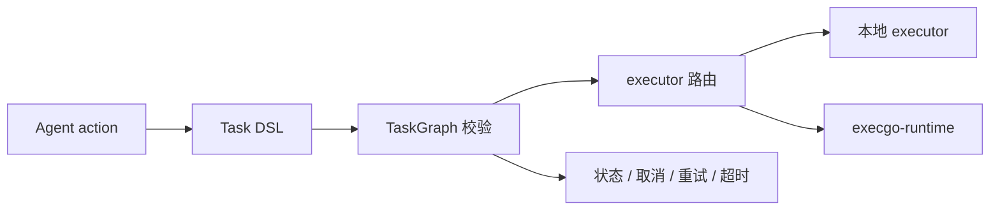

execgo 是 Agent 动作进入可靠执行体系的控制面。它不替代 Agent 的推理、规划或上下文管理，而是把已经选定的动作变成结构化任务，并负责校验、调度、状态、取消、重试、超时和观测。

控制面的核心价值是把“Agent 想做什么”翻译成稳定的任务契约：上游可以是 Claude Code、Codex、Hermes Agent、OpenClaw 或自研 Agent；下游可以是本地 executor、MCP 工具、CLI skills，也可以是独立部署的 [execgo-runtime](/docs/runtime) 数据面。

<DocsGrid>
  <DocsCard
    href="/docs/execgo/quickstart"
    eyebrow="开始"
    title="快速开始"
    description="构建控制面、本地运行、提交任务，并使用共享适配器 CLI。"
  />
  <DocsCard
    href="/docs/execgo/documentation-map"
    eyebrow="地图"
    title="文档地图"
    description="从源仓库同步过来的文档索引，适合查找控制面已有主题。"
  />
  <DocsCard
    href="/docs/execgo/integration/agent-adapter"
    eyebrow="Agent"
    title="通用 Agent 适配器"
    description="把 Agent action 翻译成 execgo 任务，理解工具发现、execgocli 与适配器端点。"
  />
  <DocsCard
    href="/docs/execgo/orchestrator"
    eyebrow="调度"
    title="编排语义"
    description="把 DAG 映射到 TaskGraph，安全轮询，并理解失败与取消规则。"
  />
  <DocsCard
    href="/docs/execgo/deploy/compose"
    eyebrow="部署"
    title="部署"
    description="用 Docker Compose 或 Kubernetes 运行 ExecGo，并接好持久化与健康检查。"
  />
  <DocsCard
    href="/docs/execgo/reference/api"
    eyebrow="参考"
    title="API 与 Task DSL"
    description="查阅 HTTP API、任务模型、执行器参数、CLI 契约和安全策略。"
  />
</DocsGrid>

在控制面文档中，重点关注这些问题：任务 DSL 如何描述动作，TaskGraph 如何表达依赖，executor 如何被选择，失败和取消如何向上游反馈，以及 Agent adapter API 如何把通用 Agent 的输出接入 execgo。
