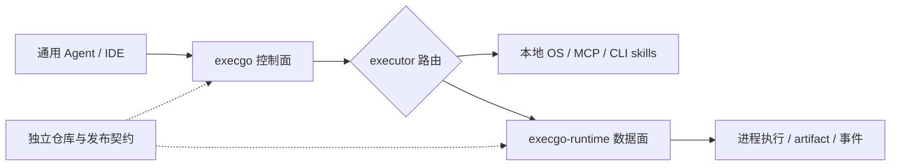

ExecGo 文档站按系统角色组织，而不是按仓库目录、历史分支或旧页面排版组织。你可以先理解四个板块，再进入具体 API、部署和集成细节。

<DocsGrid>
  <DocsCard
    href="/docs/execgo"
    eyebrow="控制面"
    title="execgo"
    description="介绍 Go 控制面如何接收结构化动作、校验任务图、调度 executor，并统一状态、取消、重试与观测。"
  />
  <DocsCard
    href="/docs/runtime"
    eyebrow="数据面"
    title="execgo-runtime"
    description="介绍 Rust 数据面如何执行真实进程、沉淀 artifact、维护资源账本，并提供 sandbox、capability 与运维接口。"
  />
  <DocsCard
    href="/docs/agent"
    eyebrow="Agent"
    title="与通用 Agent 的结合"
    description="说明 Claude Code、Codex、Hermes Agent、OpenClaw 等通用 Agent 如何把推理结果交给 ExecGo 可靠执行。"
  />
  <DocsCard
    href="/docs/ecosystem"
    eyebrow="生态"
    title="execgo 生态"
    description="说明独立仓库、独立发布、兼容契约、部署拓扑、扩展边界和未来组件如何共同演进。"
  />
</DocsGrid>

推荐阅读顺序是：先看控制面 execgo，再看数据面 execgo-runtime；如果你正在把现有 Agent 接入可靠执行层，直接进入“与通用 Agent 的结合”；如果你关心版本、仓库边界和未来扩展，再进入 execgo 生态。
