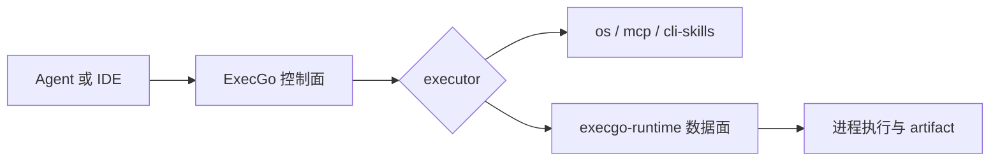

ExecGo 是面向成熟 Agent 的可靠执行层。它不接管规划与上下文系统，而是把真实动作变成可校验、可取消、可观测、可恢复的任务。

本文档不再围绕 Git 分支组织，而是按产品边界分为三段：生态、ExecGo、runtime。

<DocsGrid>
  <DocsCard
    href="/docs/ecosystem"
    eyebrow="边界"
    title="生态"
    description="说明 Agent、ExecGo、execgo-runtime、发布节奏与兼容规则如何组合。"
  />
  <DocsCard
    href="/docs/execgo"
    eyebrow="控制面"
    title="ExecGo"
    description="任务 DSL、适配器 API、调度语义、部署方式和客户端接入示例。"
  />
  <DocsCard
    href="/docs/runtime"
    eyebrow="数据面"
    title="execgo-runtime"
    description="进程执行、任务产物、资源策略、runtime API、CLI 与运维资料。"
  />
</DocsGrid>

需要稳定心智模型、接入路径和发布边界时，从本节开始。具体内容会从独立版本管理的 `execgo` 与 `execgo-runtime` 仓库同步进来。
