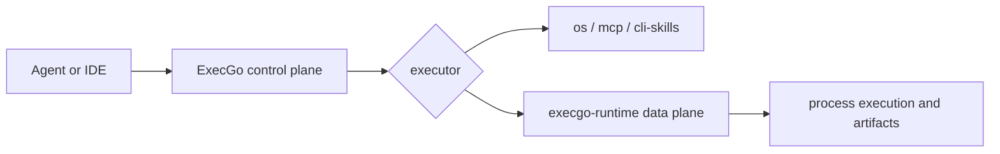

ExecGo is an execution layer for mature agents. It keeps planning and context outside the core runtime, while making real actions validated, cancellable, observable, and recoverable.

This documentation is organized around product boundaries instead of Git branches:

- [Ecosystem](/docs/ecosystem): how ExecGo, execgo-runtime, agents, and deployment units fit together.
- [ExecGo](/docs/execgo): the Go control plane, task DSL, adapter API, runtime executor, and integration contracts.
- [execgo-runtime](/docs/runtime): the Rust data plane for process execution, task artifacts, resource policy, and operational deployment.

Use the repository snapshots and branch pages when you need implementation-level details. Use this MDX section when you need the stable mental model, integration path, and release boundary.
