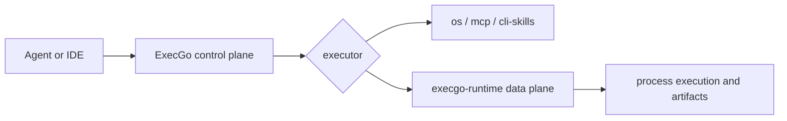

ExecGo is an execution layer for mature agents. It keeps planning and context outside the core runtime, while making real actions validated, cancellable, observable, and recoverable.

This documentation is organized around product boundaries instead of Git branches.

<DocsGrid>
  <DocsCard
    href="/docs/ecosystem"
    eyebrow="Boundary"
    title="Ecosystem"
    description="How agents, ExecGo, execgo-runtime, releases, and compatibility rules fit together."
  />
  <DocsCard
    href="/docs/execgo"
    eyebrow="Control plane"
    title="ExecGo"
    description="Task DSL, adapter API, scheduler semantics, deployment, and client integration examples."
  />
  <DocsCard
    href="/docs/runtime"
    eyebrow="Data plane"
    title="execgo-runtime"
    description="Process execution, task artifacts, resource policy, runtime API, CLI, and operations."
  />
</DocsGrid>

Use this MDX section when you need the stable mental model, integration path, and release boundary. Source content is synchronized from the independently versioned `execgo` and `execgo-runtime` repositories.
