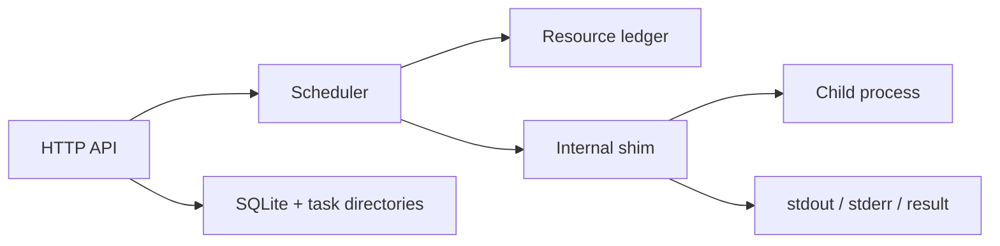

execgo-runtime is a single service with a clear boundary:

- The HTTP server receives requests, validates payloads, exposes status, and handles cancellation.
- The scheduler reserves local resources and dispatches accepted work.
- The internal shim runs the requested command or script.
- SQLite and per-task directories persist metadata, events, and artifacts.

This makes runtime behavior inspectable even when the upstream agent or control plane restarts.
