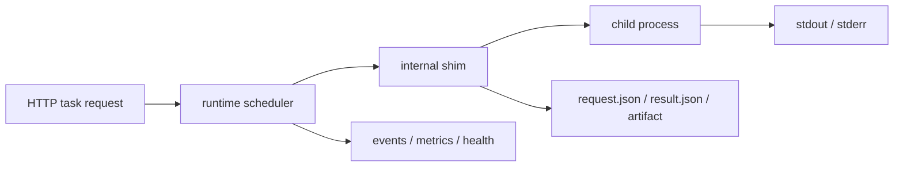

execgo-runtime 是独立发布、独立部署的数据面运行时。它接收来自 execgo 控制面或其他调用方的明确 HTTP 任务请求，执行真实进程，持久化任务元数据、日志和 artifact，并把状态、事件与能力信息回传给上游。

数据面的职责不是理解自然语言，也不是替 Agent 做决策；它的重点是把“已经确定要执行的动作”放到可运维、可审计、可恢复的运行边界中。

<DocsGrid>
  <DocsCard
    href="/docs/runtime/quickstart"
    eyebrow="开始"
    title="快速开始"
    description="构建 Rust runtime，启动 HTTP 服务，提交任务并检查 artifact。"
  />
  <DocsCard
    href="/docs/runtime/documentation-map"
    eyebrow="地图"
    title="文档地图"
    description="阅读源仓库中按角色组织的 runtime 文档索引。"
  />
  <DocsCard
    href="/docs/runtime/architecture"
    eyebrow="设计"
    title="架构"
    description="理解 HTTP 服务、调度器、internal shim、持久化、恢复、事件与资源账本。"
  />
  <DocsCard
    href="/docs/runtime/api"
    eyebrow="契约"
    title="HTTP API"
    description="提交任务、查询状态、取消工作、检查事件并读取 runtime 能力。"
  />
  <DocsCard
    href="/docs/runtime/cli"
    eyebrow="CLI"
    title="命令行"
    description="使用 serve、submit、status、wait、kill、run 和 runtime 配置参数。"
  />
  <DocsCard
    href="/docs/runtime/deployment"
    eyebrow="运维"
    title="部署"
    description="用二进制、Docker、systemd、健康检查、指标、容量规划与标签完成 runtime 部署。"
  />
</DocsGrid>

在数据面文档中，重点关注这些问题：任务请求和结果契约是什么，runtime 如何启动与回收子进程，artifact 存放在哪里，资源账本和 capability 如何暴露，以及生产环境如何部署、监控和升级。
