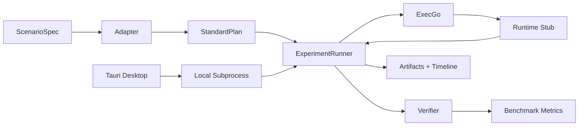

# 架构说明

## 1. 设计目标

`execgo-playground` 关注的不是 UI，而是验证：

- 计划是否能稳定落成合法 DSL
- DSL 是否能在真实 ExecGo + Runtime 中成功执行
- 失败是否可归因、可恢复、可重放

因此平台采用单一 Python 控制面，围绕真实执行闭环而不是语言样例来建模。

## 2. 分层

### Scenario Layer

- 定义输入、prompt pack、expected output、fixture、verifier
- 提供 reference plan 作为 replay 金标

### Adapter Layer

- 接收 `PlanContext`
- 生成或重放 `StandardPlan`
- 输出框架原始 trace

### Runner Layer

- 解析 stages
- 绑定上一阶段产物
- 编译为 ExecGo `TaskGraph`
- 提交、轮询、收集 stage 结果

### Harness Layer

- Docker Compose 管理 `ExecGo + Runtime + Fixtures`
- 提供 restart / kill / resource pressure / fixture mode 控制

### Observability Layer

- 写入 `timeline.jsonl`
- 写入 `execgo_snapshots.jsonl`
- 保留 `adapter_trace.json` 与 `plan.json`

### Benchmark Layer

- 矩阵运行 `framework x scenario x mode x chaos`
- 计算统一指标
- 输出结构化 JSON 与 Markdown 摘要

### Desktop Client Layer

- Tauri 2 子项目位于 `desktop-client`
- Rust 后端通过本地子进程执行 `python3 -m execgo_playground ...`
- 前端只负责命令触发、测评配置、运行结果读取与可视化
- 桌面端不直接通过网络调用训练场 Python 控制面

## 3. StandardPlan DSL

平台统一使用以下模型：

- `PlanContext`
- `StandardPlan`
- `PlanStage`
- `Binding`
- `BenchmarkRunRequest`
- `BenchmarkResult`
- `ChaosProfile`
- `TimelineEvent`

其中最关键的是 `PlanStage`：

- `task_graph`
  - 真实提交给 ExecGo 的任务图
- `bindings`
  - 将上一阶段任务结果注入当前阶段参数
- `submit_policy`
  - 控制轮询与失败停止策略

这是为了适配 ExecGo 的一个现实约束：

- `depends_on` 只表达顺序，不做自动结果注入

因此所有需要“上游结果 -> 下游参数”的场景，都必须通过分阶段提交显式实现。

## 4. 执行链路

## 5. 运行环境

默认 harness 使用三个容器：

- `execgo`
  - 构建自兄弟仓库 `../execgo`
- `runtime`
  - 兼容 ExecGo runtime executor 协议的 stub
- `fixtures`
  - 提供 advisory feed 与 chaos 控制面

控制面统一运行在宿主机 Python 进程中。

## 6. 故障注入原则

平台支持两个层级的 chaos：

- 逻辑层
  - 非法工具
  - 错误依赖
  - 绑定缺失
  - 超时预算耗尽
- 运行层
  - runtime 重启
  - runtime kill
  - fixture latency / error
  - 资源限制

所有 chaos 行为都必须写入 timeline，并进入最终 verdict 解释链路。
